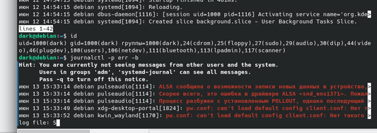
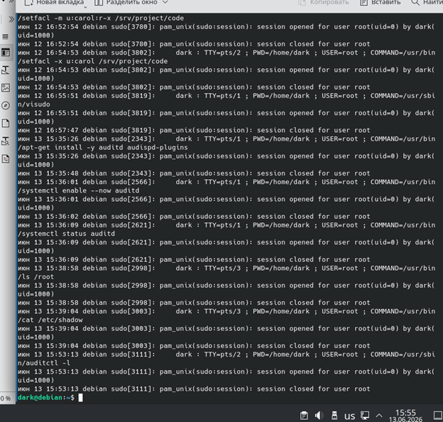

# ПР №4. Аудит событий: journalctl и auditd

### Ошибки в системе с последней загрузки

### Статистика входов

### Разбор записи SYSCALL

| Поле | Значение | Что означает |
|------|---------|-------------|
| auid | 0(root) | Audit ID — идентификатор пользователя при входе (не меняется при смене прав). |
| uid  | 0(root) | Текущий User ID пользователя, запустившего процесс. |
| euid | 0(root) | Effective User ID — фактические права доступа процесса. |
| comm | cat | Короткое имя исполняемого файла команды. |
| exe  | "/usr/bin/cat" |Полный путь к исполняемому файлу программы. |

### Как auditd отличает чтение файла от его изменения? 

По полю `syscall` и по флагам открытия файла. Если виден `open/openat` с флагами только на чтение, это доступ для чтения; если есть `O_WRONLY`, `O_RDWR`, `O_TRUNC`, `O_CREAT` и похожие флаги, это уже признак записи или изменения. Также изменение часто сопровождается системными вызовами вроде `write`, `rename`, `unlink`, `chmod`, `chown`.

### Контрольные вопросы

**1. Чем принципиально отличается auditd от journald? Почему нельзя обойтись только journald?**  
`auditd` — это специализированная система аудита Linux, которая пишет детальные события безопасности и действий в системе. `journald` — общий журнал системы; его хватает для логов сервисов, но он не заменяет полноценный аудит, потому что не даёт такой же глубины и структуры по security-событиям.

**2. Что такое auid и почему оно важнее uid при расследовании инцидентов с sudo?**  
`auid` — это ID пользователя, который изначально вошёл в систему. Он важнее `uid`, потому что после `sudo` `uid` меняется на root, а `auid` сохраняет след исходного пользователя и помогает понять, кто реально начал действие.

**3. Что означает флаг -k в правиле auditd? Для чего он используется?**  
`-k` задаёт ключ для правила аудита. Он нужен, чтобы потом удобно искать, фильтровать или удалять правила по понятной метке.

**4. Чем -w (watch) отличается от -a always,exit в правилах auditd? Когда использовать каждый?**  
`-w` — простой контроль за файлом или каталогом по пути. `-a always,exit` — более гибкое правило на системные вызовы; его используют, когда нужен точный контроль действий, а не просто наблюдение за объектом.

**5. Злоумышленник удалил файл /var/log/audit/audit.log. Как это помогает ему скрыть следы и как от этого защититься?**  
Удаление лога может скрыть часть истории событий аудита и затруднить расследование. Защита: отправлять логи на удалённый сервер, ограничивать права на файл, следить за удалением логов отдельными правилами auditd и использовать ротацию и резервное копирование.

**6. Что нужно сделать чтобы правила auditd сохранились после перезагрузки?**  
Нужно записать правила в постоянный файл конфигурации, обычно `/etc/audit/rules.d/*.rules`, и затем загрузить их через `augenrules` или сервис auditd. Иначе временные правила, добавленные командой, пропадут после перезагрузки.
