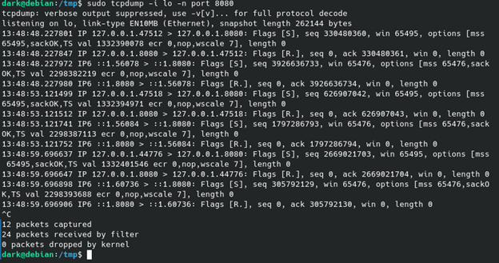

# ПР №6. Анализ сетевого трафика: tcpdump и Wireshark

## 1. Разбор строки tcpdump


| Поле | Значение | Что означает |
| :--- | :--- | :--- |
| время | Точное время | Время фиксации пакета сниффером (Часы:Минуты:Секунды.Микросекунды). |
| **IP* | Сетевой протокол | Указывает, что пакет относится к семейству протоколов IPv4. |
| **127.0.0.1.47512** | Источник (Source) | IP-адрес отправителя (`127.0.0.1` — локальный хост) и его исходный TCP-порт (`60814`), с которого клиент инициировал соединение. |
| **> 127.0.0.1.8080**  | Назначение (Destination) | Направление движения пакета к целевому IP-адресу сервера (`127.0.0.1`) и целевому TCP-порту (`8080`), на котором слушает веб-приложение. |
| **Flags [S]** | Флаг SYN | TCP-флаг «Synchronize». Означает отправку запроса на установку нового сетевого соединения (первый шаг трехэтапного рукопожатия TCP Handshake). |
| **seq 330480360** | Порядковый номер | Начальный порядковый номер (ISN) первого байта данных в этом TCP-соединении, используемый для контроля доставки пакетов. |
| **win 65495** | Размер окна (Window Size) | Количество байт (65495), которое отправитель готов принять на своей стороне без получения подтверждения ответа. |
| **options [...]** | Опции TCP | Дополнительные параметры соединения: `mss` (максимальный размер сегмента), `sackOK` (разрешение выборочного подтверждения пакетов), `TS val` (временная метка отправителя), `wscale` (коэффициент масштабирования окна). |
| **length 0** | Длина полезной нагрузки | Размер данных прикладного уровня, переносимых в пакете (0 байт, так как пакет является исключительно служебным для установки связи). |


## 2. Перехваченные данные HTTP

* **Что видно в трафике:** В перехваченном POST-запросе прикладного уровня полностью и открытым текстом видны все переданные конфиденциальные данные: заголовок авторизации `Authorization: Basic`, а также тело самого запроса, содержащее учетные данные пользователя: `username=vasya&password=MyPassword2024`.
* **Кто в реальной сети может так же прочитать этот трафик:** Любое лицо или устройство, находящееся на пути следования пакета от клиента к серверу: системные администраторы и провайдеры связи (ISP), владельцы публичных незащищенных Wi-Fi точек, а также злоумышленники, осуществляющие атаки класса MitM (Man-in-the-Middle) или ARP-spoofing в локальном сегменте сети.

## 3. Follow TCP Stream
* **Что видит злоумышленник перехвативший этот трафик:** Злоумышленник видит полную и последовательную текстовую картину обмена данными между клиентом и сервером. Ему доступен оригинальный HTTP-запрос (метод POST, запрашиваемый URL, заголовки `Host`, `User-Agent` и отправленные учетные данные) и последующий HTTP-ответ сервера (включая технические заголовки сервера и возвращаемый HTML-код `<!DOCTYPE HTML...>` ответа).

## 4. HTTP vs HTTPS — сравнение

| Что наблюдаем | HTTP | HTTPS |
| :--- | :--- | :--- |
| **IP-адреса** | Видны | **Видны** (сетевой уровень IP не шифруется, он необходим для маршрутизации пакетов). |
| **Заголовки** | Видны | **Не видны** (полностью инкапсулированы внутри зашифрованного слоя TLS). |
| **Тело запроса** | Видно | **Не видно** (передается в виде высокоэнтропийного бинарного шифротекста). |
| **Логин/пароль** | Видны | **Не видны** (криптографически защищены сквозным шифрованием). |
| **Имя домена** | Видно в Host | **Видно только в стартовом пакете приветствия Client Hello (поле SNI)**. |

## 5. DNS и приватность

* **Какие домены видны в DNS даже при HTTPS:** В процессе мониторинга трафика на порту 53 в открытом виде фиксируются абсолютно все запрашиваемые доменные имена (например, `github.com`, `example.com`, `google.com`).
* **Что это означает для приватности:** Это означает, что базовый протокол DNS работает без шифрования. Даже если содержимое ваших диалогов и пароли на сайтах защищены с помощью HTTPS, внешние наблюдатели (провайдеры, операторы связи) всё равно видят полную историю и хронологию посещения вами конкретных веб-ресурсов, что позволяет составить цифровой профиль пользователя.

## 6. Base64

* **Декодированная строка:** `dmFzeWE6TXlQYXNzd29yZDIwMjQ=` → `vazea:MyPassword2024`
* **Why Base64 не является шифрованием:** Алгоритм Base64 — это общедоступный стандарт кодирования, предназначенный исключительно для представления бинарных данных в виде строки из безопасных ASCII-символов для передачи по текстовым протоколам. В Base64 полностью отсутствует понятие секретного ключа (пароля шифрования), поэтому любой перехваченный текст может быть мгновенно возвращен в исходный вид стандартными средствами любой операционной системы за одну команду.

## 7. tshark vs tcpdump

| Инструмент | Когда использовать |
| :--- | :--- |
| **tcpdump** | Оптимален для быстрой и легковесной работы в CLI на серверах. Используется для низкоуровневого перехвата сырого трафика (захват в pcap-файлы) и фильтрации пакетов «на лету» без значительной нагрузки на CPU. |
| **tshark** | Применяется, когда необходим продвинутый консольный анализ и парсинг прикладных протоколов. Идеален для автоматизации, скриптов и вывода глубокой агрегированной статистики (например, иерархии протоколов через ключ `-z io,phs`). |
| **Wireshark** | Используется на локальных рабочих станциях ИБ-аналитиков, когда для расследования инцидента необходим мощный графический интерфейс (GUI), визуальный поиск по цветам, детальный ручной разбор структуры каждого пакета и удобная сборка сессий через Follow Stream. |

## 8. Каналы утечки через сеть

* **Какие меры защиты закрывают сетевой канал утечки:** 1. Повсеместный принудительный переход с HTTP на защищенный протокол **HTTPS (TLS версии 1.3)** для исключения перехвата данных в открытом виде.
  2. Использование механизмов **HSTS** (HTTP Strict Transport Security), запрещающих браузерам подключаться по небезопасному HTTP.
  3. Внедрение шифрованных протоколов разрешения имен — **DoH (DNS over HTTPS)** или **DoT (DNS over TLS)** для сокрытия имен посещаемых доменов от провайдера.
  4. Применение надежных корпоративных **VPN-туннелей** для инкапсуляции и шифрования абсолютно всего сетевого трафика рабочей станции на транспортном уровне.

## Контрольные вопросы

**1. Что такое promiscuous mode и зачем он нужен снифферу?**  
Это режим, в котором сетевая карта принимает все пакеты, а не только адресованные ей. Он нужен снифферу, чтобы видеть максимум трафика на интерфейсе.

**2. Чем отличается capture filter от display filter в Wireshark?**  
Capture filter отсекает пакеты ещё во время захвата, а display filter только скрывает их в окне просмотра. Первый влияет на то, что будет сохранено, второй — только на отображение. 

**3. Что такое Follow TCP Stream и для чего используется?**  
Это функция, которая собирает и показывает весь разговор TCP-сессии в одном окне. Её используют, чтобы быстро увидеть полный обмен данными между клиентом и сервером.

**4. Почему Base64 в HTTP Basic Auth не является защитой? Что нужно использовать вместо?**  
Base64 — это кодирование, а не шифрование; его легко декодировать. Вместо HTTP Basic Auth нужно использовать HTTPS, чтобы защитить передаваемые учётные данные.

**5. Какие данные утекают даже при использовании HTTPS? Как это исправить?**  
Обычно могут быть видны метаданные: IP-адреса, доменное имя через SNI, время и объём трафика. Снижают утечки с помощью современных настроек TLS, шифрования DNS и минимизации лишних заголовков. 

**6. Сисадмин говорит: «у нас свитч, а не хаб — значит сниффинг невозможен». Он прав?**  
Нет. На свитче сниффинг сложнее, но возможен через SPAN/mirror-порт, TAP, ARP-spoofing и при доступе к нужному сегменту сети. 

**7. Напишите фильтр tcpdump который перехватывает только DNS-запросы (UDP порт 53) от конкретного IP 192.168.1.50.**  
```bash
tcpdump -i any 'src host 192.168.1.50 and udp dst port 53'
```  
Если нужны именно DNS-пакеты от этого IP в обоих направлениях, можно использовать:  
```bash
tcpdump -i any 'host 192.168.1.50 and udp port 53'
```
